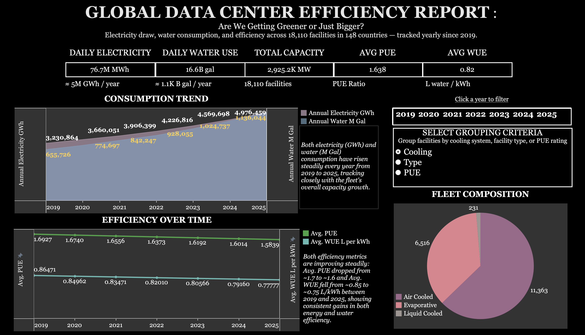
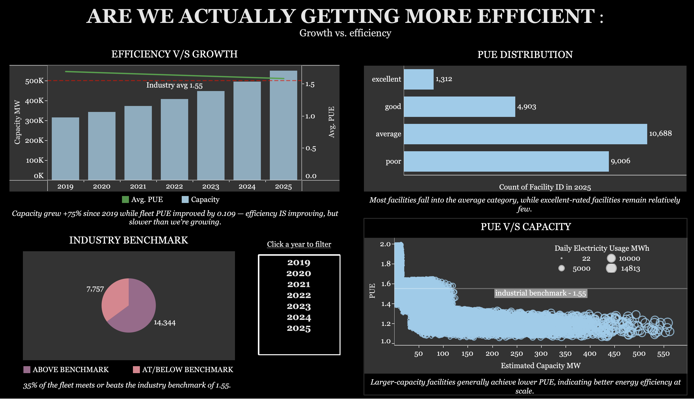

# Global Data Center Sustainability & Efficiency Analysis

**Are we actually getting more efficient — or just bigger?**

An end-to-end analysis of ~18,000 global data center facilities (2019–2025), exploring the relationship between energy efficiency (PUE), water efficiency (WUE), fleet growth, cooling technology, facility type, and geography. Built with Python (EDA) and Tableau (interactive dashboards).

## Key finding

Efficiency **is** improving — average PUE fell from 1.75 (2019) to 1.64 (2025), a ~6.4% improvement — but total fleet capacity grew even faster, from ~120K MW to ~131K MW (+9.5%) over the same period. Individual facilities are getting greener, but total energy demand keeps rising because growth is outpacing efficiency gains.

## Contents

- **`notebooks/data_center_sustainability_eda.ipynb`** — Python EDA: data cleaning, PUE/WUE analysis, cooling system and facility type breakdowns, year-over-year trend analysis.
- **`dashboards/screenshots/`** — Final Tableau dashboards:
  - `dashboard_1_overview.png` — Global fleet KPIs, consumption trend, efficiency trend, interactive fleet composition breakdown (by cooling system / facility type / PUE category).
  - `dashboard_2_efficiency_vs_growth.png` — Efficiency vs. growth comparison, PUE distribution, industry benchmark comparison, PUE vs. capacity scatter (does scale correlate with efficiency?).

## Tools used

- **Python** (Pandas, NumPy, Matplotlib) — data cleaning and exploratory analysis
- **Tableau** — interactive dashboard design, parameter-driven views, dual-axis trend charts, LOD/table calculations

## Highlights

- Facility-type analysis shows Enterprise/Standard facilities account
